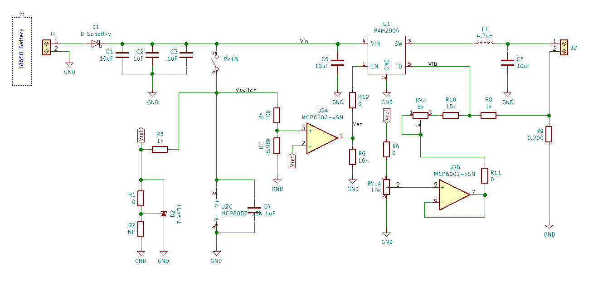

# Dimming LED Controller

This is a basic dimming LED controller, designed for being run from one or more batteries (~3.25-6 volts).  It includes:

- Analog dimming.
- Low-voltage shutdown.
- Able to run at up to 1A.
- Two-layer board.

# Modifications
There are a number of modifications possible:

- Change R4/R7 to provide the low-voltage shutdown point.
- Tune RV2/R10 to tweak the feedback offset.
- Set maximum current via R9 (see PAM2804 datasheet for more information).
- Don't populate D2/U2/RV1 (and supporting components) if dimming isn't needed (pull-up on EN needed).

# Wiring

1. Make sure the switching potentiometer is turned off (i.e past the switch detent, counter-clockwise).
2. Attach your LED(s) to J2 Pin 1/+ and J2 Pin 2/-.
3. Attach your power supply to J1 Pin 1/+ and J1 Pin 2/-.

# Dimming Setup

1. Turn the potentiometer on, just past the switch detent.
2. Turn the potentiometer the opposite direction, until resistance is felt.  The LEDs might turn off.
3. If the LEDs are off, adjust RV2 until they are on.
4. If the LEDs were off, adjust RV2 until they just barely turn on.
5. Verify that the potentiometer now gives you complete brightness range for your LEDs.
